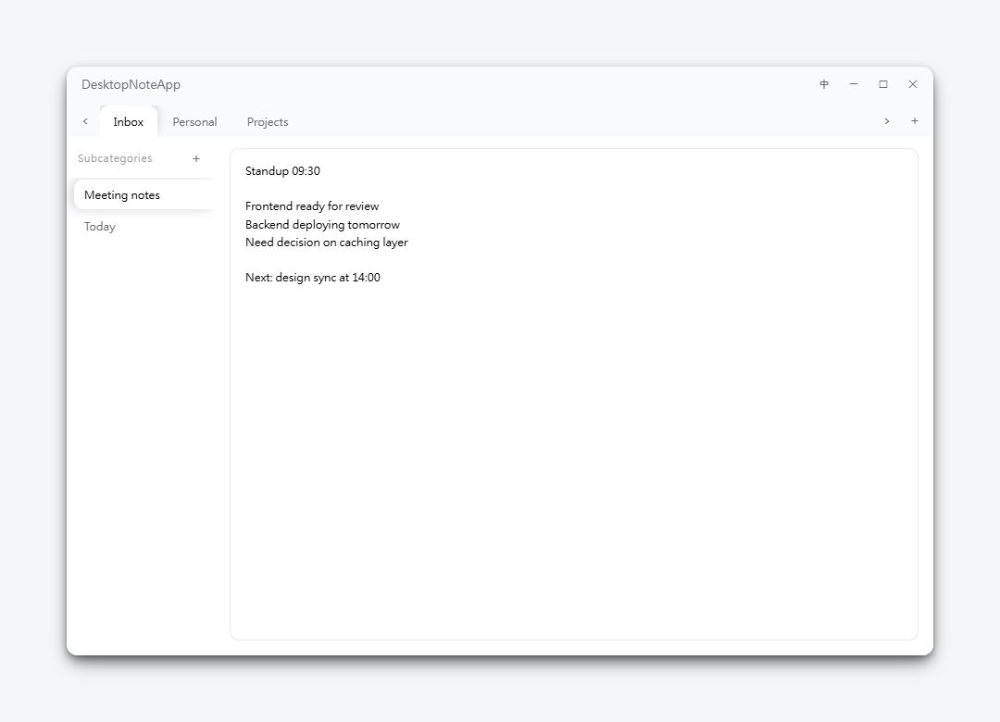

# DesktopNoteApp · 極簡記事本

> 兩層分類的桌面記事本：主分類 → 子分類 → 內文，即時自動保存。
> A two-level desktop notepad: main categories → sub-categories → content, with live auto-save.

[](https://tauri.app/)
[](https://vuejs.org/)
[](https://www.typescriptlang.org/)
[](LICENSE)



---

## 特色 / Features

**中文**
- **兩層分類結構**：上方主分類 tab + 左側子分類 sidebar + 右側內文編輯區
- **即時自動保存**：300 ms debounce，內容變更自動寫入磁碟，atomic rename 防壞檔
- **雙語介面**：預設英文，點標題列右上 **中** / **EN** 按鈕一鍵切換繁體中文，選擇記憶在 `localStorage`
- **毛玻璃外殼**：視窗本體 40% 半透明白覆蓋桌面，外圍透明 + 4 層深陰影 = 卡片浮在桌面上
- **視覺**：透明畫布上的圓角浮卡，4 層柔和陰影；統一 10 px 圓角、Inter + Microsoft JhengHei 字型
- **動態標籤**：選中的 tab 上方圓角凸出、選中的子分類左方圓角凸出，無縫連接到內文區
- **輕量**：Installer 約 1 MB，執行記憶體約 30 MB，per-user 安裝免管理員權限

**English**
- **Two-level hierarchy**: top main-category tabs + left sub-category sidebar + right content editor
- **Live auto-save**: 300 ms debounce, changes are written to disk via atomic rename — safe against power loss
- **Bilingual UI**: English by default; click the **中** / **EN** toggle at the top-right of the title bar to switch to Traditional Chinese. The choice is remembered in `localStorage`
- **Frosted-glass shell**: window body is 40 % translucent white over the desktop; the transparent 32 px padding ring with a 4-layer deep shadow makes the card visibly float
- **Visuals**: rounded floating card on a transparent canvas, 4-layer soft shadow; unified 10 px radius, Inter + Microsoft JhengHei typography
- **Dynamic tabs**: active tab pops out with rounded top corners, active sub-category pops out with rounded left corners, both seamlessly connecting to the content area
- **Lightweight**: ~1 MB installer, ~30 MB RAM at runtime, per-user install with no admin required

---

## 安裝 / Installation

**中文**
1. 從 [Releases](https://github.com/ltangyu/DesktopNoteApp/releases) 下載最新的 `DesktopNoteApp_x.y.z_x64-setup.exe`
2. 雙擊執行，預設安裝到 `%LOCALAPPDATA%\DesktopNoteApp\`（不需要管理員權限）
3. 從開始選單或 `%LOCALAPPDATA%\DesktopNoteApp\desktop-note-app.exe` 啟動

**English**
1. Download the latest `DesktopNoteApp_x.y.z_x64-setup.exe` from [Releases](https://github.com/ltangyu/DesktopNoteApp/releases)
2. Double-click to install — defaults to `%LOCALAPPDATA%\DesktopNoteApp\` (no admin required)
3. Launch from the Start menu or `%LOCALAPPDATA%\DesktopNoteApp\desktop-note-app.exe`

**系統需求 / Requirements**: Windows 10 1803+ or Windows 11, [WebView2 Runtime](https://developer.microsoft.com/microsoft-edge/webview2) (usually pre-installed).

---

## 操作 / Usage

| 動作 / Action | 操作 / How |
|---|---|
| 切換主分類 / Switch main category | 點擊上方 tab / Click a top tab |
| 切換子分類 / Switch sub-category | 點擊左側 sub-tab / Click a left sub-tab |
| 新增主/子分類 / Add main or sub | 點「+」按鈕 / Click the **+** button |
| 重命名 / Rename | 在 tab / sub-tab 上**雙擊** / **Double-click** a tab |
| 刪除 / Delete | 在 tab / sub-tab 上**右鍵點擊** / **Right-click** a tab |
| 主分類過多時捲動 / Scroll overflow tabs | 點上方 ‹ › 箭頭 / Click the ‹ › arrows |
| 編輯內容 / Edit content | 在右側 textarea 直接輸入（自動保存）/ Type in the textarea (auto-saved) |
| 拖曳視窗 / Drag window | 在標題列空白處按住拖曳 / Hold the title bar empty area and drag |
| 視窗控制 / Window controls | 標題列右上 ─ □ ✕ / The ─ □ ✕ buttons at the top-right |

---

## 資料儲存 / Data Storage

**中文**

資料儲存於 `%APPDATA%\desktop-note-app\data.json`，巢狀 JSON 結構：

```json
{
  "主分類A": {
    "子分類1": "內容字串",
    "子分類2": "..."
  },
  "主分類B": { }
}
```

- **寫入安全**：使用 atomic rename（先寫 `.tmp` 再 rename），斷電或崩潰不會壞檔
- **卸載保留**：解除安裝程式不會自動刪除資料夾，舊資料安全

**English**

Data is stored at `%APPDATA%\desktop-note-app\data.json` as nested JSON:

```json
{
  "MainCategoryA": {
    "SubCategory1": "content string",
    "SubCategory2": "..."
  },
  "MainCategoryB": { }
}
```

- **Safe writes**: atomic rename pattern (write `.tmp` then rename) — safe against power loss / crash
- **Preserved on uninstall**: the uninstaller never deletes the data folder

---

## 技術棧 / Tech Stack

| Layer | Technology |
|---|---|
| Backend | [Rust](https://www.rust-lang.org/) + [Tauri v2](https://tauri.app/) (custom commands, no generic fs plugin) |
| Frontend | [Vue 3](https://vuejs.org/) SFC + Composition API + [Pinia](https://pinia.vuejs.org/) |
| Type safety | TypeScript strict (incl. `noUncheckedIndexedAccess` + `exactOptionalPropertyTypes`) |
| Build | [Vite 5](https://vitejs.dev/) + [vue-tsc](https://github.com/vuejs/language-tools) |
| Bundle | NSIS (Windows installer) |

**安全 / Security**: Rust 後端只暴露兩個 IPC 指令（`load_notes` / `save_notes`），路徑寫死於 `%APPDATA%\desktop-note-app\`，無 generic fs/shell/http plugin。 Rust backend exposes only two IPC commands; the data path is hard-coded; no generic filesystem, shell, or HTTP plugins are exposed.

---

## 從原始碼建置 / Build from Source

### 前置需求 / Prerequisites
- [Node.js ≥ 18](https://nodejs.org/)
- [Rust toolchain (stable)](https://rustup.rs/)
- Microsoft Visual Studio Build Tools (C++ workload) — Windows only
- [WebView2 Runtime](https://developer.microsoft.com/microsoft-edge/webview2) — usually pre-installed on Win 10 1803+ / Win 11

### 指令 / Commands

```bash
# 安裝依賴 / Install dependencies
npm install

# 開發模式（HMR）/ Development mode with hot module reload
npm run tauri dev

# 正式打包 / Production build
npm run tauri build
# 產出 / Output:
#   src-tauri/target/release/desktop-note-app.exe
#   src-tauri/target/release/bundle/nsis/DesktopNoteApp_x.y.z_x64-setup.exe
```

### 專案結構 / Project Structure

```
DesktopNoteApp/
├── src/                        # Vue 3 前端 / Vue 3 frontend
│   ├── components/             #   WindowControls, TabBar, Sidebar, NoteEditor, InputModal
│   ├── stores/notes.ts         #   Pinia store: state + CRUD actions
│   ├── types/notes.ts          #   Notes = Record<string, Record<string, string>>
│   ├── styles/                 #   tokens.css (design tokens) + global.css
│   ├── App.vue
│   └── main.ts
├── src-tauri/                  # Rust 後端 / Rust backend
│   ├── src/
│   │   ├── main.rs             #   Entry, WebView2 transparent env var
│   │   └── commands.rs         #   load_notes / save_notes (atomic save)
│   ├── capabilities/           #   IPC permissions whitelist
│   ├── Cargo.toml
│   └── tauri.conf.json         #   Window settings, bundle config, CSP
├── index.html
├── package.json
├── tsconfig.json               # strict + noUncheckedIndexedAccess
└── vite.config.ts
```

---

## 授權 / License

MIT — 詳見 [LICENSE](LICENSE) / See [LICENSE](LICENSE).
